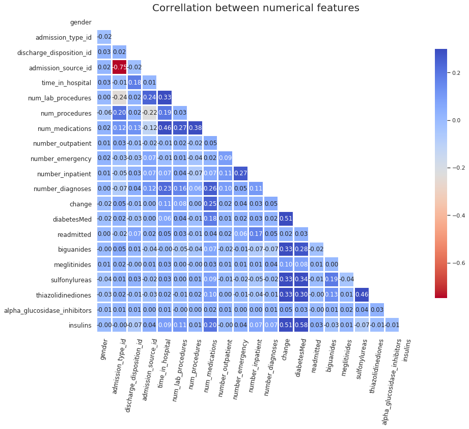
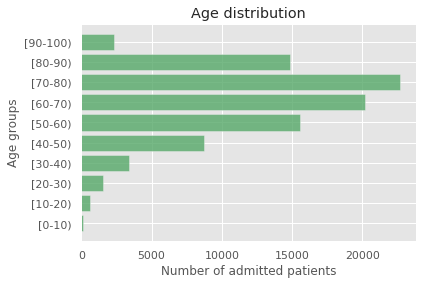
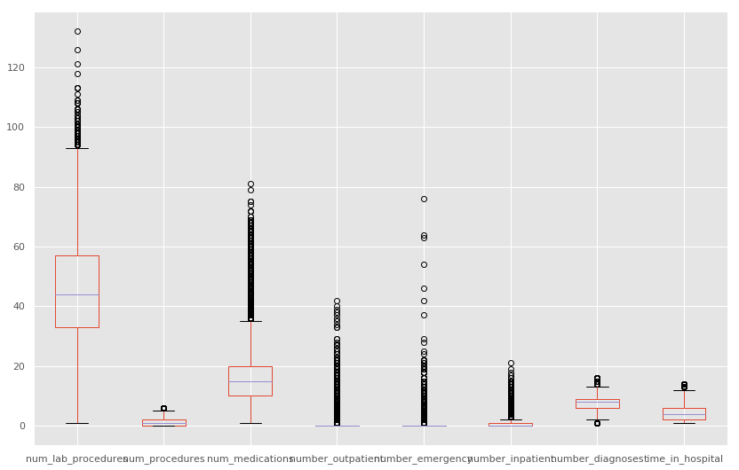
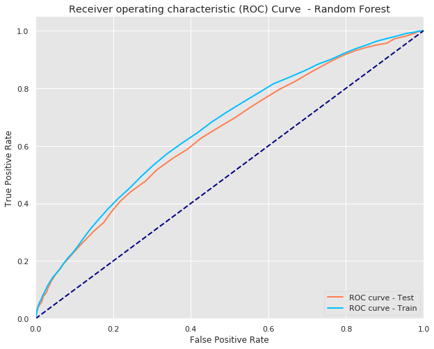
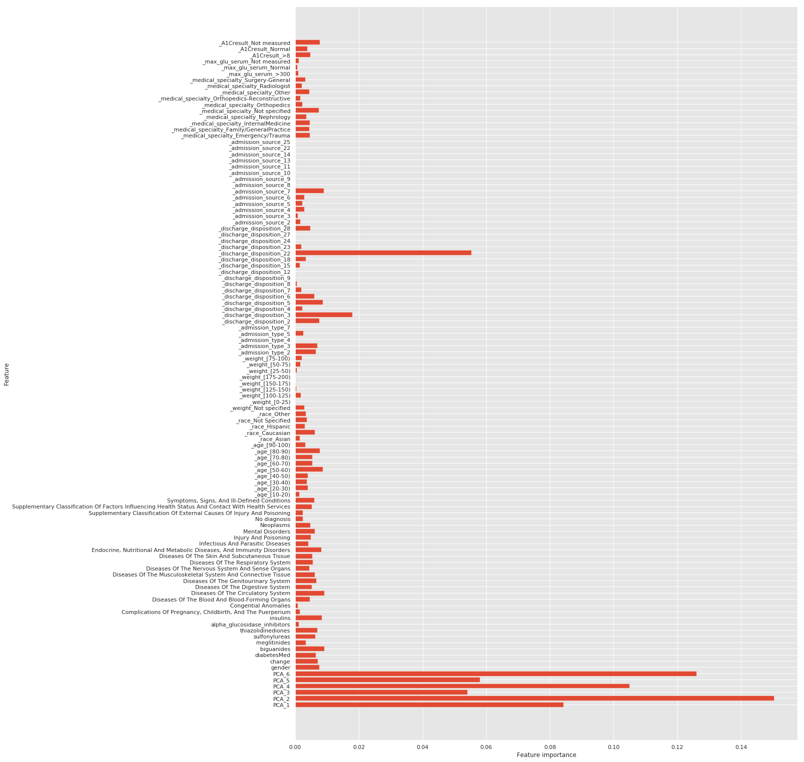
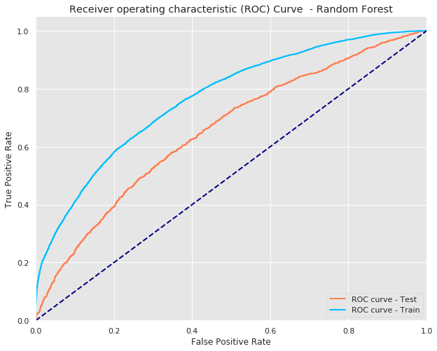

# Motivation

Hospital readmission after an admitted patient is discharged is a high priority for hospitals. In total Hospital Readmissions are one of the most costly episodes to treat, costing Medicare about 26 billion annually, with about 17 billion consisting of avoidable trips after discharge. 

The health care burden of hospitalized patients with diabetes (1 and 2) is substantial and only growing. As of today, around 9% of Americans have diabetes or prediabetes, according to a recent CDC report. 

A better understanding of the factors that lead to hospital readmissions could help decision makers understand potential ways to reduce early readmissions (within 30 days) and provide more efficient care.

## Classification problem

**We focused our project on attempting to predict whether a discharged diabetic patient will be readmitted into a hospital within 30 days (Target = 1)  or not (Target = 0).**


```python
# Import necessary packages
import pandas as pd
import numpy as np
from bs4 import BeautifulSoup
import requests
import seaborn as sns
import matplotlib.pyplot as plt
import collections
from sklearn.preprocessing import LabelEncoder, Normalizer
from sklearn.model_selection import train_test_split, GridSearchCV
from sklearn.linear_model import LogisticRegression
from sklearn.metrics import accuracy_score, confusion_matrix, classification_report, recall_score, precision_score, roc_curve, auc
from sklearn.tree import DecisionTreeClassifier
from sklearn.ensemble import BaggingClassifier, RandomForestClassifier
from sklearn.neighbors import KNeighborsClassifier as KNN
import warnings
warnings.filterwarnings("ignore", category=FutureWarning)
```

# Part 1 : Exploratory data analysis


```python
df = pd.read_csv('diabetic_data.csv')
```


```python
df.shape
```


    (101766, 50)


At first, it seems like there are no null values. In reality, there is unavailable information which is represented by a question mark('?') in the dataframe.


```python
df.info()
```

    <class 'pandas.core.frame.DataFrame'>
    RangeIndex: 101766 entries, 0 to 101765
    Data columns (total 50 columns):
    encounter_id                101766 non-null int64
    patient_nbr                 101766 non-null int64
    race                        101766 non-null object
    gender                      101766 non-null object
    age                         101766 non-null object
    weight                      101766 non-null object
    admission_type_id           101766 non-null int64
    discharge_disposition_id    101766 non-null int64
    admission_source_id         101766 non-null int64
    time_in_hospital            101766 non-null int64
    payer_code                  101766 non-null object
    medical_specialty           101766 non-null object
    num_lab_procedures          101766 non-null int64
    num_procedures              101766 non-null int64
    num_medications             101766 non-null int64
    number_outpatient           101766 non-null int64
    number_emergency            101766 non-null int64
    number_inpatient            101766 non-null int64
    diag_1                      101766 non-null object
    diag_2                      101766 non-null object
    diag_3                      101766 non-null object
    number_diagnoses            101766 non-null int64
    max_glu_serum               101766 non-null object
    A1Cresult                   101766 non-null object
    metformin                   101766 non-null object
    repaglinide                 101766 non-null object
    nateglinide                 101766 non-null object
    chlorpropamide              101766 non-null object
    glimepiride                 101766 non-null object
    acetohexamide               101766 non-null object
    glipizide                   101766 non-null object
    glyburide                   101766 non-null object
    tolbutamide                 101766 non-null object
    pioglitazone                101766 non-null object
    rosiglitazone               101766 non-null object
    acarbose                    101766 non-null object
    miglitol                    101766 non-null object
    troglitazone                101766 non-null object
    tolazamide                  101766 non-null object
    examide                     101766 non-null object
    citoglipton                 101766 non-null object
    insulin                     101766 non-null object
    glyburide-metformin         101766 non-null object
    glipizide-metformin         101766 non-null object
    glimepiride-pioglitazone    101766 non-null object
    metformin-rosiglitazone     101766 non-null object
    metformin-pioglitazone      101766 non-null object
    change                      101766 non-null object
    diabetesMed                 101766 non-null object
    readmitted                  101766 non-null object
    dtypes: int64(13), object(37)
    memory usage: 38.8+ MB


## Mapping Admission, Discharge & Admission Source Types

A separate .csv file contains mapping codes to their description. The file contains all mapping codes, including:
- admission type codes
- discharge type codes
- admission source codes


```python
# importing mapping.csv
mapping = pd.read_csv('IDs_mapping.csv')
```


```python
#Separating codes by type

admission_type_map = mapping[:8]
discharge_type_map = mapping[10:40]
admission_source_map = mapping[42:]

#Renaming columns
discharge_type_map.columns = ['discharge_disposition_id','description']
admission_source_map.columns = ['admission_source_id', 'description']
```


```python
discharge_type_map.head(2)
```


<div>
<style scoped>
    .dataframe tbody tr th:only-of-type {
        vertical-align: middle;
    }

    .dataframe tbody tr th {
        vertical-align: top;
    }

    .dataframe thead th {
        text-align: right;
    }
</style>
<table border="1" class="dataframe">
  <thead>
    <tr style="text-align: right;">
      <th></th>
      <th>discharge_disposition_id</th>
      <th>description</th>
    </tr>
  </thead>
  <tbody>
    <tr>
      <th>10</th>
      <td>1</td>
      <td>Discharged to home</td>
    </tr>
    <tr>
      <th>11</th>
      <td>2</td>
      <td>Discharged/transferred to another short term h...</td>
    </tr>
  </tbody>
</table>
</div>


Removing discharge codes 11 (Expired), 13-14 (Hospice care), 19-21 (Expired) as they consider the patient is terminally ill and the probability of being readmitted is equal to 0. 


```python
# Removing discharge codes 11 (Expired), 13-14 (Hospice care), 19-21 (Expired)
terminally_ill = [11,13,14,19,21]
df = df[~df['discharge_disposition_id'].isin(terminally_ill)]
```


```python
# Removing NaN & Not mapped values
df = df[~df['admission_type_id'].isin([6,8])]
df = df[~df['admission_source_id'].isin([17,20])]
df = df[~df['discharge_disposition_id'].isin([25])]
```


```python
# Replacing values into 0 for no change and 1 for change 

df.change = df.change.replace(to_replace = 'Ch', value = 1)
df.change = df.change.replace(to_replace = 'No', value = 0)
df.gender = df.gender.replace(to_replace = 'Female', value = 1)
df.gender = df.gender.replace(to_replace = 'Male', value = 0)

#change our diabetes values 
dm = {'Yes': 1, 'No': 0}
df['diabetesMed'] = df['diabetesMed'].replace(to_replace = (dm), value=None)
```

It's important to note that the same patients appear several times as they can be admitted more than once. We decide to treat each patient's visit independently and not consider information regarding earlier visits as additional information.


```python
# Identifying duplicate patients

duplicates = df[df.patient_nbr.isin(df.patient_nbr[df.patient_nbr.duplicated()])].sort_values(by = 'patient_nbr')
duplicates[['patient_nbr', 'number_inpatient', 'readmitted']].head()
```


<div>
<style scoped>
    .dataframe tbody tr th:only-of-type {
        vertical-align: middle;
    }

    .dataframe tbody tr th {
        vertical-align: top;
    }

    .dataframe thead th {
        text-align: right;
    }
</style>
<table border="1" class="dataframe">
  <thead>
    <tr style="text-align: right;">
      <th></th>
      <th>patient_nbr</th>
      <th>number_inpatient</th>
      <th>readmitted</th>
    </tr>
  </thead>
  <tbody>
    <tr>
      <th>4780</th>
      <td>135</td>
      <td>1</td>
      <td>&gt;30</td>
    </tr>
    <tr>
      <th>4267</th>
      <td>135</td>
      <td>0</td>
      <td>&lt;30</td>
    </tr>
    <tr>
      <th>23623</th>
      <td>1152</td>
      <td>1</td>
      <td>&gt;30</td>
    </tr>
    <tr>
      <th>24642</th>
      <td>1152</td>
      <td>2</td>
      <td>NO</td>
    </tr>
    <tr>
      <th>14180</th>
      <td>1152</td>
      <td>1</td>
      <td>&gt;30</td>
    </tr>
  </tbody>
</table>
</div>


For some patients' visits, gender is unknown or invalid and their corresponding rows will be removed as there are only 3 in total.


```python
# Dropping rows where gender is unavailable
df.drop(df[df.gender == 'Unknown/Invalid'].index, inplace=True)
```


```python
# Number of repeated visits for patients
(df.patient_nbr.value_counts() > 1).sum()
```


    14921


Some columns do not contain useful information regarding a patients' health and will be dropped:

- Patient_nbr: contains patient identification number
- Payer_code: contains insurance information


```python
# Dropping identification columns
df.drop('patient_nbr', axis = 1, inplace= True) # Dropping identification column
df.drop('payer_code', axis = 1, inplace= True) # Dropping Insurance information
```


```python
# Exploring medication values to drop columns containing no information based on value counts
medication = ['max_glu_serum', 'A1Cresult','metformin', 'repaglinide', 'nateglinide', 'chlorpropamide',
       'glimepiride', 'acetohexamide', 'glipizide', 'glyburide', 'tolbutamide',
       'pioglitazone', 'rosiglitazone', 'acarbose', 'miglitol', 'troglitazone',
       'tolazamide', 'examide', 'citoglipton', 'insulin',
       'glyburide-metformin', 'glipizide-metformin',
       'glimepiride-pioglitazone', 'metformin-rosiglitazone',
       'metformin-pioglitazone']

meds_df = df[medication].apply(pd.Series.value_counts)
meds_df
```


<div>
<style scoped>
    .dataframe tbody tr th:only-of-type {
        vertical-align: middle;
    }

    .dataframe tbody tr th {
        vertical-align: top;
    }

    .dataframe thead th {
        text-align: right;
    }
</style>
<table border="1" class="dataframe">
  <thead>
    <tr style="text-align: right;">
      <th></th>
      <th>max_glu_serum</th>
      <th>A1Cresult</th>
      <th>metformin</th>
      <th>repaglinide</th>
      <th>nateglinide</th>
      <th>chlorpropamide</th>
      <th>glimepiride</th>
      <th>acetohexamide</th>
      <th>glipizide</th>
      <th>glyburide</th>
      <th>...</th>
      <th>troglitazone</th>
      <th>tolazamide</th>
      <th>examide</th>
      <th>citoglipton</th>
      <th>insulin</th>
      <th>glyburide-metformin</th>
      <th>glipizide-metformin</th>
      <th>glimepiride-pioglitazone</th>
      <th>metformin-rosiglitazone</th>
      <th>metformin-pioglitazone</th>
    </tr>
  </thead>
  <tbody>
    <tr>
      <th>&gt;200</th>
      <td>8.0</td>
      <td>NaN</td>
      <td>NaN</td>
      <td>NaN</td>
      <td>NaN</td>
      <td>NaN</td>
      <td>NaN</td>
      <td>NaN</td>
      <td>NaN</td>
      <td>NaN</td>
      <td>...</td>
      <td>NaN</td>
      <td>NaN</td>
      <td>NaN</td>
      <td>NaN</td>
      <td>NaN</td>
      <td>NaN</td>
      <td>NaN</td>
      <td>NaN</td>
      <td>NaN</td>
      <td>NaN</td>
    </tr>
    <tr>
      <th>&gt;300</th>
      <td>259.0</td>
      <td>NaN</td>
      <td>NaN</td>
      <td>NaN</td>
      <td>NaN</td>
      <td>NaN</td>
      <td>NaN</td>
      <td>NaN</td>
      <td>NaN</td>
      <td>NaN</td>
      <td>...</td>
      <td>NaN</td>
      <td>NaN</td>
      <td>NaN</td>
      <td>NaN</td>
      <td>NaN</td>
      <td>NaN</td>
      <td>NaN</td>
      <td>NaN</td>
      <td>NaN</td>
      <td>NaN</td>
    </tr>
    <tr>
      <th>&gt;7</th>
      <td>NaN</td>
      <td>3564.0</td>
      <td>NaN</td>
      <td>NaN</td>
      <td>NaN</td>
      <td>NaN</td>
      <td>NaN</td>
      <td>NaN</td>
      <td>NaN</td>
      <td>NaN</td>
      <td>...</td>
      <td>NaN</td>
      <td>NaN</td>
      <td>NaN</td>
      <td>NaN</td>
      <td>NaN</td>
      <td>NaN</td>
      <td>NaN</td>
      <td>NaN</td>
      <td>NaN</td>
      <td>NaN</td>
    </tr>
    <tr>
      <th>&gt;8</th>
      <td>NaN</td>
      <td>7463.0</td>
      <td>NaN</td>
      <td>NaN</td>
      <td>NaN</td>
      <td>NaN</td>
      <td>NaN</td>
      <td>NaN</td>
      <td>NaN</td>
      <td>NaN</td>
      <td>...</td>
      <td>NaN</td>
      <td>NaN</td>
      <td>NaN</td>
      <td>NaN</td>
      <td>NaN</td>
      <td>NaN</td>
      <td>NaN</td>
      <td>NaN</td>
      <td>NaN</td>
      <td>NaN</td>
    </tr>
    <tr>
      <th>Down</th>
      <td>NaN</td>
      <td>NaN</td>
      <td>526.0</td>
      <td>42.0</td>
      <td>10.0</td>
      <td>1.0</td>
      <td>179.0</td>
      <td>NaN</td>
      <td>483.0</td>
      <td>494.0</td>
      <td>...</td>
      <td>NaN</td>
      <td>NaN</td>
      <td>NaN</td>
      <td>NaN</td>
      <td>10750.0</td>
      <td>6.0</td>
      <td>NaN</td>
      <td>NaN</td>
      <td>NaN</td>
      <td>NaN</td>
    </tr>
    <tr>
      <th>No</th>
      <td>NaN</td>
      <td>NaN</td>
      <td>71756.0</td>
      <td>88523.0</td>
      <td>89310.0</td>
      <td>89907.0</td>
      <td>85174.0</td>
      <td>89980.0</td>
      <td>78807.0</td>
      <td>80524.0</td>
      <td>...</td>
      <td>89979.0</td>
      <td>89952.0</td>
      <td>89981.0</td>
      <td>89981.0</td>
      <td>41606.0</td>
      <td>89291.0</td>
      <td>89968.0</td>
      <td>89980.0</td>
      <td>89979.0</td>
      <td>89980.0</td>
    </tr>
    <tr>
      <th>None</th>
      <td>89668.0</td>
      <td>74238.0</td>
      <td>NaN</td>
      <td>NaN</td>
      <td>NaN</td>
      <td>NaN</td>
      <td>NaN</td>
      <td>NaN</td>
      <td>NaN</td>
      <td>NaN</td>
      <td>...</td>
      <td>NaN</td>
      <td>NaN</td>
      <td>NaN</td>
      <td>NaN</td>
      <td>NaN</td>
      <td>NaN</td>
      <td>NaN</td>
      <td>NaN</td>
      <td>NaN</td>
      <td>NaN</td>
    </tr>
    <tr>
      <th>Norm</th>
      <td>46.0</td>
      <td>4716.0</td>
      <td>NaN</td>
      <td>NaN</td>
      <td>NaN</td>
      <td>NaN</td>
      <td>NaN</td>
      <td>NaN</td>
      <td>NaN</td>
      <td>NaN</td>
      <td>...</td>
      <td>NaN</td>
      <td>NaN</td>
      <td>NaN</td>
      <td>NaN</td>
      <td>NaN</td>
      <td>NaN</td>
      <td>NaN</td>
      <td>NaN</td>
      <td>NaN</td>
      <td>NaN</td>
    </tr>
    <tr>
      <th>Steady</th>
      <td>NaN</td>
      <td>NaN</td>
      <td>16737.0</td>
      <td>1312.0</td>
      <td>639.0</td>
      <td>67.0</td>
      <td>4328.0</td>
      <td>1.0</td>
      <td>10028.0</td>
      <td>8241.0</td>
      <td>...</td>
      <td>2.0</td>
      <td>28.0</td>
      <td>NaN</td>
      <td>NaN</td>
      <td>27515.0</td>
      <td>677.0</td>
      <td>13.0</td>
      <td>1.0</td>
      <td>2.0</td>
      <td>1.0</td>
    </tr>
    <tr>
      <th>Up</th>
      <td>NaN</td>
      <td>NaN</td>
      <td>962.0</td>
      <td>104.0</td>
      <td>22.0</td>
      <td>6.0</td>
      <td>300.0</td>
      <td>NaN</td>
      <td>663.0</td>
      <td>722.0</td>
      <td>...</td>
      <td>NaN</td>
      <td>1.0</td>
      <td>NaN</td>
      <td>NaN</td>
      <td>10110.0</td>
      <td>7.0</td>
      <td>NaN</td>
      <td>NaN</td>
      <td>NaN</td>
      <td>NaN</td>
    </tr>
  </tbody>
</table>
<p>10 rows × 25 columns</p>
</div>


```python
# Dropping encounter_id & medication with less than 2 varying values
df.drop(['encounter_id','metformin-pioglitazone','metformin-rosiglitazone',
         'glimepiride-pioglitazone','troglitazone','acetohexamide','examide','citoglipton'], axis =1, inplace= True)
```

Many columns contain '?', None as an answer. For the following columns, they will be replaced by an appropriate value:

- For weight, race, medical_specialty, value will be replaced by "Not specified".
- For max_glu_serum, A1Cresult, value should be interpreted as "Not Measured", according to https://www.hindawi.com/journals/bmri/2014/781670/tab1/


```python
# Replacing '?' Values into appropriate values

df.weight = df.weight.replace(to_replace='?', value='Not specified') # Not specified for Weight
df.race = df.race.replace(to_replace='?', value='Not Specified') # 'Not specified for Race
df.medical_specialty = df.medical_specialty.replace(to_replace='?', value='Not specified') # 'Not specified' for Med.Specialty
df.max_glu_serum = df.max_glu_serum.replace(to_replace='None', value = 'Not measured') # According to https://www.hindawi.com/journals/bmri/2014/781670/tab1/
df.max_glu_serum = df.max_glu_serum.replace(to_replace='Norm', value = 'Normal') # To make it more readable
df.A1Cresult = df.A1Cresult.replace(to_replace='None', value = 'Not measured') # According to https://www.hindawi.com/journals/bmri/2014/781670/tab1/
df.A1Cresult = df.A1Cresult.replace(to_replace='Norm', value = 'Normal') # To make it more readable
```

## Target Variable: Setting Early (within 30 days) readmission to '1' 


```python
# First, checking for NA values in target variable
df.readmitted.isna().sum() 
```


    0


>We are trying to predict patient early readmissions (within 30 days), therefore we combine readmissions over 30 days in the same group as non readmitted patients. In this case, we have a binary classification problem and logistic regression can be used as a base model.


```python
# Combining > 30 days before readmission and No as one category
df.readmitted = df.readmitted.replace(to_replace='>30', value='0')
df.readmitted = df.readmitted.replace(to_replace='NO', value='0')
df.readmitted = df.readmitted.replace(to_replace='<30', value='1')
```


```python
# Changing Object type columns to int because values are 0 or 1
df.readmitted = df.readmitted.astype(int)
df.gender = df.gender.astype(int)
```

## Verifying if Class Imbalance exists for target variable

> The target variable identifying whether a patient was readmitted early (within 30 days) is imbalanced, 11% of patients were readmitted within 30 days.
To combat imbalanced data, we opted to **downsample** the 'No' category. This will allow us to achieve a balance ratio closer to 1:1 and improve our binary classification predictions.


```python
# Checking for class imbalance
df.readmitted.value_counts(normalize = True)
```


    0    0.88592
    1    0.11408
    Name: readmitted, dtype: float64


##  Webscraping ICD-9 Codes & their descriptions

> In health care, diagnosis codes are used as a tool to group and identify diseases, disorders, symptoms, poisonings, adverse effects of drugs and chemicals, injuries and other reasons for patient encounters. Diagnostic coding is the translation of written descriptions of diseases, illnesses and injuries into codes from a particular classification. In medical classification, diagnosis codes are used as part of the clinical coding process alongside intervention codes. International Statistical Classification of Diseases and Related Health Problems (ICD) is one of the most widely used classification systems for diagnosis coding as it allows comparability and use of mortality and morbidity data.

>ICD codes in this dataset refer to ICD-9 codes.


```python
# Page to scrape
page = f'http://www.icd9data.com/2008/Volume1/default.htm'

# Make a get request to retrieve the page
html_page = requests.get(page)

# Pass the page content to beautiful soup for parsing
soup = BeautifulSoup(html_page.content, 'html.parser') 
pretty_soup = soup.prettify()

# Beautiful soup to retrieve ICD codes & description
icd9 = [li.text.split('  ') for li in soup.find('ul').find_all('li')]

# Converting diagnosis codes into dataframe
icd9_df = pd.DataFrame(icd9, columns = ['icd9_range', 'diagnosis_desc'])

# Creating a range of values for icd9 codes
icd9_df['icd9_range'] = list(icd9_df['icd9_range'].apply(lambda x: x.split('-')))

icd9_df
```


<div>
<style scoped>
    .dataframe tbody tr th:only-of-type {
        vertical-align: middle;
    }

    .dataframe tbody tr th {
        vertical-align: top;
    }

    .dataframe thead th {
        text-align: right;
    }
</style>
<table border="1" class="dataframe">
  <thead>
    <tr style="text-align: right;">
      <th></th>
      <th>icd9_range</th>
      <th>diagnosis_desc</th>
    </tr>
  </thead>
  <tbody>
    <tr>
      <th>0</th>
      <td>[001, 139]</td>
      <td>Infectious And Parasitic Diseases</td>
    </tr>
    <tr>
      <th>1</th>
      <td>[140, 239]</td>
      <td>Neoplasms</td>
    </tr>
    <tr>
      <th>2</th>
      <td>[240, 279]</td>
      <td>Endocrine, Nutritional And Metabolic Diseases,...</td>
    </tr>
    <tr>
      <th>3</th>
      <td>[280, 289]</td>
      <td>Diseases Of The Blood And Blood-Forming Organs</td>
    </tr>
    <tr>
      <th>4</th>
      <td>[290, 319]</td>
      <td>Mental Disorders</td>
    </tr>
    <tr>
      <th>5</th>
      <td>[320, 389]</td>
      <td>Diseases Of The Nervous System And Sense Organs</td>
    </tr>
    <tr>
      <th>6</th>
      <td>[390, 459]</td>
      <td>Diseases Of The Circulatory System</td>
    </tr>
    <tr>
      <th>7</th>
      <td>[460, 519]</td>
      <td>Diseases Of The Respiratory System</td>
    </tr>
    <tr>
      <th>8</th>
      <td>[520, 579]</td>
      <td>Diseases Of The Digestive System</td>
    </tr>
    <tr>
      <th>9</th>
      <td>[580, 629]</td>
      <td>Diseases Of The Genitourinary System</td>
    </tr>
    <tr>
      <th>10</th>
      <td>[630, 677]</td>
      <td>Complications Of Pregnancy, Childbirth, And Th...</td>
    </tr>
    <tr>
      <th>11</th>
      <td>[680, 709]</td>
      <td>Diseases Of The Skin And Subcutaneous Tissue</td>
    </tr>
    <tr>
      <th>12</th>
      <td>[710, 739]</td>
      <td>Diseases Of The Musculoskeletal System And Con...</td>
    </tr>
    <tr>
      <th>13</th>
      <td>[740, 759]</td>
      <td>Congential Anomalies</td>
    </tr>
    <tr>
      <th>14</th>
      <td>[760, 779]</td>
      <td>Certain Conditions Originating In The Perinata...</td>
    </tr>
    <tr>
      <th>15</th>
      <td>[780, 799]</td>
      <td>Symptoms, Signs, And Ill-Defined Conditions</td>
    </tr>
    <tr>
      <th>16</th>
      <td>[800, 999]</td>
      <td>Injury And Poisoning</td>
    </tr>
    <tr>
      <th>17</th>
      <td>[V01, V86]</td>
      <td>Supplementary Classification Of Factors Influe...</td>
    </tr>
    <tr>
      <th>18</th>
      <td>[E800, E999]</td>
      <td>Supplementary Classification Of External Cause...</td>
    </tr>
  </tbody>
</table>
</div>


### Mapping diagnosis codes to grouped ICD-9 codes


```python
# Function to map diagnosis codes to the description of group disease they belong to

def icd_map(code):
    
    # Special characters mapping
    if str(code)[0] == 'V':
        return icd9_df.diagnosis_desc.loc[17]
    elif str(code)[0] == 'E':
        return icd9_df.diagnosis_desc.loc[18]
    
    # Replacing question mark into No diagnosis
    elif str(code)[0] == '?':
        return 'No diagnosis'
    
    # Numerical codes mapping
    else:
        code = round(float(code),0)
        for i in range(0,19):
            if code in range(int(icd9_df.icd9_range[i][0]),int(icd9_df.icd9_range[i][1])+1):
                return icd9_df.diagnosis_desc[i]
```


```python
# Feature Engineering - Mapping to ICD9 codes and merging to initial dataframe
df['diag1_desc'] = df['diag_1'].apply(icd_map)
df['diag2_desc'] = df['diag_2'].apply(icd_map)
df['diag3_desc'] = df['diag_3'].apply(icd_map)
```


```python
# Diagnosis table
diagnosis = df[['diag1_desc','diag2_desc','diag3_desc']].apply(pd.Series.value_counts)
diagnosis
```


<div>
<style scoped>
    .dataframe tbody tr th:only-of-type {
        vertical-align: middle;
    }

    .dataframe tbody tr th {
        vertical-align: top;
    }

    .dataframe thead th {
        text-align: right;
    }
</style>
<table border="1" class="dataframe">
  <thead>
    <tr style="text-align: right;">
      <th></th>
      <th>diag1_desc</th>
      <th>diag2_desc</th>
      <th>diag3_desc</th>
    </tr>
  </thead>
  <tbody>
    <tr>
      <th>Complications Of Pregnancy, Childbirth, And The Puerperium</th>
      <td>663</td>
      <td>409</td>
      <td>292</td>
    </tr>
    <tr>
      <th>Congential Anomalies</th>
      <td>43</td>
      <td>95</td>
      <td>87</td>
    </tr>
    <tr>
      <th>Diseases Of The Blood And Blood-Forming Organs</th>
      <td>1016</td>
      <td>2566</td>
      <td>2202</td>
    </tr>
    <tr>
      <th>Diseases Of The Circulatory System</th>
      <td>26911</td>
      <td>27728</td>
      <td>26549</td>
    </tr>
    <tr>
      <th>Diseases Of The Digestive System</th>
      <td>8130</td>
      <td>3478</td>
      <td>3142</td>
    </tr>
    <tr>
      <th>Diseases Of The Genitourinary System</th>
      <td>4564</td>
      <td>7169</td>
      <td>5592</td>
    </tr>
    <tr>
      <th>Diseases Of The Musculoskeletal System And Connective Tissue</th>
      <td>4417</td>
      <td>1603</td>
      <td>1716</td>
    </tr>
    <tr>
      <th>Diseases Of The Nervous System And Sense Organs</th>
      <td>1100</td>
      <td>1157</td>
      <td>1562</td>
    </tr>
    <tr>
      <th>Diseases Of The Respiratory System</th>
      <td>8903</td>
      <td>8782</td>
      <td>5825</td>
    </tr>
    <tr>
      <th>Diseases Of The Skin And Subcutaneous Tissue</th>
      <td>2257</td>
      <td>3264</td>
      <td>2213</td>
    </tr>
    <tr>
      <th>Endocrine, Nutritional And Metabolic Diseases, And Immunity Disorders</th>
      <td>10196</td>
      <td>18576</td>
      <td>23228</td>
    </tr>
    <tr>
      <th>Infectious And Parasitic Diseases</th>
      <td>2350</td>
      <td>1683</td>
      <td>1626</td>
    </tr>
    <tr>
      <th>Injury And Poisoning</th>
      <td>6271</td>
      <td>2178</td>
      <td>1729</td>
    </tr>
    <tr>
      <th>Mental Disorders</th>
      <td>2009</td>
      <td>2367</td>
      <td>2774</td>
    </tr>
    <tr>
      <th>Neoplasms</th>
      <td>2869</td>
      <td>2116</td>
      <td>1538</td>
    </tr>
    <tr>
      <th>No diagnosis</th>
      <td>18</td>
      <td>340</td>
      <td>1254</td>
    </tr>
    <tr>
      <th>Supplementary Classification Of External Causes Of Injury And Poisoning</th>
      <td>1</td>
      <td>634</td>
      <td>1064</td>
    </tr>
    <tr>
      <th>Supplementary Classification Of Factors Influencing Health Status And Contact With Health Services</th>
      <td>1451</td>
      <td>1688</td>
      <td>3570</td>
    </tr>
    <tr>
      <th>Symptoms, Signs, And Ill-Defined Conditions</th>
      <td>6812</td>
      <td>4148</td>
      <td>4018</td>
    </tr>
  </tbody>
</table>
</div>


```python
# Dropping ICD9 code columns as they are now grouped
df = df.drop(['diag_1','diag_2','diag_3'],axis =1)
```


```python
df.shape
```


    (89981, 40)


### Grouping drugs by drug class

>To reduce dimensionality, we grouped 16 medications into 5 drug families.

> biguanides : The term biguanide refers to a group of oral type 2 diabetes drugs that work by preventing the production of glucose in the liver, improving the body's sensitivity towards insulin and reducing the amount of sugar absorbed by the intestines.

> meglitinides : The glinides are a class of drug which have a similar response as sulphonylureas but act for a shorter time. Meglitinides are prescribed to be taken by people with type 2 diabetes within half an hour before eating. As the drugs act for a shorter period than sulphonylureas, the side effects of hypoglycemia and weight gain have a smaller likelihood.

> sulfonylureas : Sulphonylureas are the class of antidiabetic drug for type 2 diabetes that tends to include those drugs which end in ‘ide’. They work by increasing the amount of insulin the pancreas produces and increasing the working effectiveness of insulin. The mode of action of sulphonylureas means that hypoglycemia and weight gain can be relatively common side effects.

> thiazolidinediones : Thiazolidinediones, also known as glitazones, are a medication for type 2 diabetes which help to improve insulin sensitivity and have been found to help decrease triglyceride levels.

> alpha_glucosidase_inhibitors : Alpha-glucosidase inhibitors, such as acarbose (marketed as Precose or Glucobay) or miglitol (branded as Glyset) are drugs for type 2 diabetes which slow down the digestion of carbohydrates in the small intestine and therefore can help to reduce after meal blood sugar levels.

> insulins : Insulin is a hormone which helps to regulate blood sugar. A number of different types of insulin are available as medication, with some insulins acting for as long as a day and others acting for only a few hours.

source : https://www.diabetes.co.uk/diabetes-medication/


```python
# create a dictionary with the different medication families for each diabetes drug so that
# we can manipulate these columns and narrow down the amount of features we are using
drug_classes = {'biguanides' : ['metformin', 'glyburide-metformin', 'glipizide-metformin'], 
                'meglitinides':['repaglinide','nateglinide'], 
                'sulfonylureas': ['chlorpropamide','glimepiride','glipizide', 'glyburide','tolbutamide', 'tolazamide','glyburide-metformin', 'glipizide-metformin'], 
                'thiazolidinediones': ['pioglitazone','rosiglitazone'], 
                'alpha_glucosidase_inhibitors': ['acarbose', 'miglitol'], 
                'insulins': ['insulin']}

#Create dictionarty with our keys as the data found in our medication columns and the values of each key as a Bool  
replaced = {'Steady': True, 'Up': True, 'Down': True, 'No': False} 


#Iterate through and classify our patients as either on our off each medication, by changing our values for 'Down, Up, Steady' to True and our value for 'No' as False
for column in df.iloc[:,18:34]:
    df[column] = df[column].replace(to_replace = replaced, value = None)
```


```python
# need to create new dummy variable column for each drug class family and 
# have it equal true if the individual is on a medication for any drug within that family

df['biguanides'] = df[(df['metformin'] == True) | (df['glyburide-metformin'] == True) | (df['glipizide-metformin'] == True)].any(axis=1)
df['biguanides'] = df['biguanides'].fillna(False) 


# create a conditional statement
df['meglitinides'] = df[(df['repaglinide'] == True) | (df['nateglinide'] == True)].any(axis=1)
df['meglitinides'] = df['meglitinides'].fillna(False) 


df['sulfonylureas'] = df[(df['chlorpropamide'] == True) | (df['glimepiride'] == True) | (df['glipizide']==True) | (df['glyburide'] == True) | (df['tolbutamide'] == True) | (df['tolazamide'] == True) | (df['glyburide-metformin'] == True) | (df['glipizide-metformin'] == True)].any(axis=1) 
df['sulfonylureas'] = df['sulfonylureas'].fillna(False)                                                            
                                            

df['thiazolidinediones'] = df[(df['pioglitazone'] == True) | (df['rosiglitazone'] == True) | (df['glipizide'] == True)].any(axis=1)
df['thiazolidinediones'] = df['thiazolidinediones'].fillna(False)     


df['alpha_glucosidase_inhibitors'] = df[(df['acarbose'] == True) | (df['miglitol'] == True)].any(axis=1)
df['alpha_glucosidase_inhibitors'] = df['alpha_glucosidase_inhibitors'].fillna(False)


df['insulins'] = df[(df['insulin'] == True)].any(axis=1) 
df['insulins'] = df['insulins'].fillna(False)  


df = df.drop(df.iloc[:,18:34], axis =1)

```

### Medical specialties: Retaining 10 medical specialties

> To reduce dimensionality of medical specialties, we have grouped all the medical specialties who had less than 500 patients into one category called "Other".


```python
# Identifying Top 10 medical specialties, will group all other specialties into 'Other' category
df.medical_specialty.value_counts() > 500
```


    Not specified                            True
    InternalMedicine                         True
    Emergency/Trauma                         True
    Family/GeneralPractice                   True
    Cardiology                               True
    Surgery-General                          True
    Orthopedics                              True
    Nephrology                               True
    Radiologist                              True
    Orthopedics-Reconstructive               True
    Psychiatry                               True
    Pulmonology                              True
    Surgery-Cardiovascular/Thoracic          True
    ObstetricsandGynecology                  True
    Urology                                  True
    Surgery-Vascular                        False
    Gastroenterology                        False
    Surgery-Neuro                           False
    PhysicalMedicineandRehabilitation       False
    Oncology                                False
    Pediatrics                              False
    Neurology                               False
    Pediatrics-Endocrinology                False
    Otolaryngology                          False
    Endocrinology                           False
    Psychology                              False
    Podiatry                                False
    Surgery-Cardiovascular                  False
    Surgery-Thoracic                        False
    Pediatrics-CriticalCare                 False
                                            ...  
    Pediatrics-Pulmonology                  False
    Obsterics&Gynecology-GynecologicOnco    False
    Obstetrics                              False
    Anesthesiology-Pediatric                False
    Rheumatology                            False
    Pathology                               False
    OutreachServices                        False
    Anesthesiology                          False
    Pediatrics-Neurology                    False
    Surgery-Colon&Rectal                    False
    PhysicianNotFound                       False
    Surgery-Pediatric                       False
    Endocrinology-Metabolism                False
    Cardiology-Pediatric                    False
    Surgery-Maxillofacial                   False
    Psychiatry-Child/Adolescent             False
    DCPTEAM                                 False
    Pediatrics-Hematology-Oncology          False
    Pediatrics-EmergencyMedicine            False
    Pediatrics-AllergyandImmunology         False
    Dentistry                               False
    Resident                                False
    Dermatology                             False
    Neurophysiology                         False
    Proctology                              False
    SportsMedicine                          False
    Pediatrics-InfectiousDiseases           False
    Psychiatry-Addictive                    False
    Perinatology                            False
    AllergyandImmunology                    False
    Name: medical_specialty, Length: 71, dtype: bool


```python
#create a list for our top 10 professions which will allow us to group all of our other values into "Other" 
medprofessions = ['Not specified', 'InternalMedicine', 'Emergency/Trauma', 'Family/GeneralPractice', 'Cardiology', 'Surgery-General', 'Orthopedics', 'Nephrology', 'Radiologist', 'Orthopedics-Reconstructive']


#replace all values in medical_specialty column that are not considered the most common with the value 'Other'
df.loc[~df.medical_specialty.isin(medprofessions), 'medical_specialty'] = 'Other'
```

### Correlation Heatmap

> There is a -0.75 correlation between admission source id and admission type id. There is no correlation over |0.8| between numerical variables, therefore they will all be included in the initial model as regressors.


```python
# Correlation heatmap
mask = np.zeros_like(df.corr(), dtype=np.bool)
mask[np.triu_indices_from(mask)] = True
sns.set(style="white")

plt.figure(figsize=(14,12))

sns.heatmap(df.corr(),mask=mask, annot= True, vmax=.3,cmap = 'coolwarm_r', square=True, fmt='.2f',
            linewidths=2, cbar_kws={"shrink": 0.75})
plt.title('Correllation between numerical features', size = 20)
plt.xticks(rotation=80, size = 12)
plt.yticks(size = 12)
```


    (array([ 0.5,  1.5,  2.5,  3.5,  4.5,  5.5,  6.5,  7.5,  8.5,  9.5, 10.5,
            11.5, 12.5, 13.5, 14.5, 15.5, 16.5, 17.5, 18.5, 19.5, 20.5]),
     <a list of 21 Text yticklabel objects>)





```python
df1 = df.copy(deep=True)
```

### Combining 3 diagnosis into one indicator

> Function to identify which diseases were present for each patient by encoding each of disease classifications as dummy columns.


```python
def make_col_diagnosis(diagnosis):
    df1[diagnosis] = df1[(df1['diag1_desc'] == diagnosis) | (df1['diag2_desc'] == diagnosis)
                       | (df1['diag3_desc'] == diagnosis)].any(axis=1)
    df1[diagnosis] = df1[diagnosis].fillna(False)
```


```python
for diag in diagnosis.T.columns.tolist():
    make_col_diagnosis(diag)
```


```python
df1 = df1.drop(['diag1_desc','diag2_desc','diag3_desc'], axis = 1)
```


```python
df1 = df1.reset_index()
df1 = df1.drop('index', axis =1) 
```

### Exploring distribution of age 


```python
age_dict = df1.age.value_counts().to_dict()
age_dict = collections.OrderedDict(sorted(age_dict.items()))
age_dict
```


    OrderedDict([('[0-10)', 146),
                 ('[10-20)', 640),
                 ('[20-30)', 1526),
                 ('[30-40)', 3415),
                 ('[40-50)', 8697),
                 ('[50-60)', 15550),
                 ('[60-70)', 20157),
                 ('[70-80)', 22689),
                 ('[80-90)', 14822),
                 ('[90-100)', 2339)])


```python
# Horizontal barplot
plt.style.use('ggplot')
plt.barh(np.arange(10), list(age_dict.values()), align='center', alpha=0.8, color = 'g')
plt.yticks(np.arange(10), age_dict.keys())
plt.xlabel('Number of admitted patients')
plt.ylabel('Age groups')
plt.title('Age distribution')
plt.figure(figsize=(12,8))
plt.show()
```





    <Figure size 864x576 with 0 Axes>


### Exploring distribution of numerical variables


```python
df1[['num_lab_procedures', 'num_procedures',
       'num_medications', 'number_outpatient', 'number_emergency',
       'number_inpatient', 'number_diagnoses','time_in_hospital']].boxplot(figsize = (14,9))
```


    <matplotlib.axes._subplots.AxesSubplot at 0x120df2a90>





### Dimensionality reduction: PCA limited to 6 components


```python
X_scale = ['time_in_hospital',
 'num_lab_procedures',
 'num_procedures',
 'num_medications',
 'number_outpatient',
 'number_emergency',
 'number_inpatient',
 'number_diagnoses']
```


```python
#import Standard Scaler and use it to scale our continuous variables 
from sklearn.preprocessing import StandardScaler
scaler = StandardScaler()
scaled_for_x = scaler.fit(df1[X_scale])
x = scaled_for_x.transform(df1[X_scale]) 

#using PCA to reduce dimensionality of our continuous variables 
from sklearn.decomposition import PCA

pca = PCA(n_components = 6)
principalComponents = pca.fit_transform(x)
principalDf = pd.DataFrame(data = principalComponents, columns = ['PCA_1', 'PCA_2', 'PCA_3', 'PCA_4', 'PCA_5','PCA_6'])

#examine the variance explained by our Principal Components
print(pca.explained_variance_ratio_)

```

    [0.25388298 0.17179902 0.12493312 0.11906943 0.10244657 0.09167577]


```python
#add our new PCA columns to our dataframe
df1 = pd.concat([principalDf, df1], axis=1) 
#drop our old continuous variable columns
df1.drop(X_scale, axis = 1, inplace=True)
```

## Dummy Variables Encoding for Categorical Data

>  Label encoding for categorical data not changed manually: 'age','race', 'weight', 'admission_type_id',
       'discharge_disposition_id', 'admission_source_id',
       'medical_specialty', 'max_glu_serum', 'A1Cresult'


```python
# Creating Dummy variables for all the following categorical columns

X_dummies = ['age','race', 'weight', 'admission_type_id',
       'discharge_disposition_id', 'admission_source_id',
       'medical_specialty', 'max_glu_serum', 'A1Cresult']

dummies_1 = pd.get_dummies(df1['age'], prefix = 'age', drop_first = True).rename(columns=lambda x: '_' + str(x))
dummies_2 = pd.get_dummies(df1['race'],prefix = 'race', drop_first = True).rename(columns=lambda x: '_' + str(x))
dummies_3 = pd.get_dummies(df1['weight'],prefix = 'weight', drop_first = True).rename(columns=lambda x: '_' + str(x))
dummies_4 = pd.get_dummies(df1['admission_type_id'],prefix = 'admission_type', drop_first = True).rename(columns=lambda x: '_' + str(x))
dummies_5 = pd.get_dummies(df1['discharge_disposition_id'],prefix = 'discharge_disposition', drop_first = True).rename(columns=lambda x: '_' + str(x))
dummies_6 = pd.get_dummies(df1['admission_source_id'],prefix = 'admission_source', drop_first = True).rename(columns=lambda x: '_' + str(x))
dummies_7 = pd.get_dummies(df1['medical_specialty'],prefix = 'medical_specialty', drop_first = True).rename(columns=lambda x: '_' + str(x))
dummies_8 = pd.get_dummies(df1['max_glu_serum'],prefix = 'max_glu_serum', drop_first = True).rename(columns=lambda x: '_' + str(x))
dummies_9 = pd.get_dummies(df1['A1Cresult'],prefix = 'A1Cresult', drop_first = True).rename(columns=lambda x: '_' + str(x))
```


```python
# Adding dummy columns to Dataframe
dummies = [dummies_1,dummies_2,dummies_3,dummies_4,dummies_5,dummies_6,dummies_7,dummies_8,dummies_9]
for dummy in dummies:
    df1 = pd.concat([df1, dummy], axis=1)
```


```python
# Dropping dummies encoded columns
df1.drop(X_dummies, axis =1, inplace=True)
```


```python
df1.shape
```


    (89981, 179)


# Part 2: Preparing data for modeling

### Setting regressors X & target variable y


```python
y = df1.readmitted
X = df1.drop(['readmitted'], axis = 1)
```


```python
y.shape
```


    (89981,)


```python
X.shape
```


    (89981, 178)


### Under sampling y & Setting Training sets for X and y


```python
np.random.seed(0)
```


```python
from imblearn.under_sampling import RandomUnderSampler
```


```python
X_resampled, y_resampled = RandomUnderSampler().fit_sample(X,y)
```


```python
print(y.value_counts()) #Previous original class distribution
X_resampled, y_resampled = RandomUnderSampler().fit_sample(X, y) 
print(pd.Series(y_resampled).value_counts()) #Preview synthetic sample class distribution
```

    0    79716
    1    10265
    Name: readmitted, dtype: int64
    1    10265
    0    10265
    dtype: int64


```python
#split our data into a test and train set
X_train, X_test, y_train, y_test = train_test_split(X_resampled,y_resampled,test_size = .20) 
```

### ROC-AUC curve function


```python
def create_roc_auc(model):
    y_score = model.predict_proba(X_test)[:,1]
    fpr, tpr, thresholds = roc_curve(y_test, y_score)
    
    y_score_train = model.predict_proba(X_train)[:,1]
    fpr_t, tpr_t, thresholds_t = roc_curve(y_train, y_score_train)
    sns.set_style("darkgrid", {"axes.facecolor": ".9"})

    print('AUC_test: {}'.format(auc(fpr, tpr)))
    print('AUC_train: {}'.format(auc(fpr_t, tpr_t)))
    
    plt.figure(figsize=(10,8))
    lw = 2
    plt.plot(fpr, tpr, color='coral',
             lw=lw, label='ROC curve - Test')
    plt.plot(fpr_t, tpr_t, color='deepskyblue',
             lw=lw, label='ROC curve - Train')
    plt.plot([0, 1], [0, 1], color='navy', lw=lw, linestyle='--')
    plt.xlim([0.0, 1.0])
    plt.ylim([0.0, 1.05])
    plt.xlabel('False Positive Rate')
    plt.ylabel('True Positive Rate')
    plt.title('Receiver operating characteristic (ROC) Curve')
    plt.legend(loc="lower right")
    plt.show()
```

## Part 3: Modeling

### Baseline Model: Logistic Regression


```python
#instantiate logreg object
logreg = LogisticRegression(fit_intercept= False)

#fit our model with our training data
model_log = logreg.fit(X_train, y_train) 

#predict our target variable 
y_train_hat = model_log.predict(X_train)
y_test_hat = model_log.predict(X_test) 
```


    ---------------------------------------------------------------------------

    ValueError                                Traceback (most recent call last)

    <ipython-input-185-285c2281e175> in <module>
          3 
          4 #fit our model with our training data
    ----> 5 model_log = logreg.fit(X_train, y_train)
          6 
          7 #predict our target variable


    ~/anaconda3/lib/python3.7/site-packages/sklearn/linear_model/logistic.py in fit(self, X, y, sample_weight)
       1218 
       1219         X, y = check_X_y(X, y, accept_sparse='csr', dtype=_dtype,
    -> 1220                          order="C")
       1221         check_classification_targets(y)
       1222         self.classes_ = np.unique(y)


    ~/anaconda3/lib/python3.7/site-packages/sklearn/utils/validation.py in check_X_y(X, y, accept_sparse, dtype, order, copy, force_all_finite, ensure_2d, allow_nd, multi_output, ensure_min_samples, ensure_min_features, y_numeric, warn_on_dtype, estimator)
        571     X = check_array(X, accept_sparse, dtype, order, copy, force_all_finite,
        572                     ensure_2d, allow_nd, ensure_min_samples,
    --> 573                     ensure_min_features, warn_on_dtype, estimator)
        574     if multi_output:
        575         y = check_array(y, 'csr', force_all_finite=True, ensure_2d=False,


    ~/anaconda3/lib/python3.7/site-packages/sklearn/utils/validation.py in check_array(array, accept_sparse, dtype, order, copy, force_all_finite, ensure_2d, allow_nd, ensure_min_samples, ensure_min_features, warn_on_dtype, estimator)
        431                                       force_all_finite)
        432     else:
    --> 433         array = np.array(array, dtype=dtype, order=order, copy=copy)
        434 
        435         if ensure_2d:


    ValueError: could not convert string to float: 'No'


```python
print('accuracy train score:', accuracy_score(y_train, y_train_hat))
print('accuracy test score:', accuracy_score(y_test, y_test_hat))
print('recall score for test:', recall_score(y_test, y_test_hat)) 
print('recall score for train:', recall_score(y_train, y_train_hat))
print('precision score for test:', precision_score(y_test, y_test_hat))
print('precision score for train:', precision_score(y_train, y_train_hat))
y_score = logreg.fit(X_train, y_train).decision_function(X_test)
```


```python
confusion_matrix(y_test, y_test_hat)
```


```python
# Residuals
resid = pd.DataFrame(abs(y_train - y_train_hat), columns=['residual'])
resid.residual.value_counts(normalize = True) #  accurate
```


```python
create_roc_auc(model_log)
```

### Tuning Logistic Regression

> Tuning logistic regression predictions with parameter grid:

> Results are similar to base model, best parameters are mostly the default values. Best parameters C = 1, penalty score based on L1 - Lasso. (default is L2), number of iterations = 100. **Lasso** shrinks some coefficients close to 0 or to 0 by penalizing the cost function.


```python
# Parameter grid

param_grid = {"max_iter" : [100,200,500],
    "penalty": ['l1','l2'],
    "C" : [1,10]}
```


```python
# Grid search & fitting logistic regression

logreg_cv = LogisticRegression()
dt_grid_search = GridSearchCV(logreg_cv, param_grid = param_grid, cv = 3, return_train_score=True, scoring = 'accuracy')
dt_grid_search.fit(X_train, y_train)
```


    GridSearchCV(cv=3, error_score='raise-deprecating',
           estimator=LogisticRegression(C=1.0, class_weight=None, dual=False, fit_intercept=True,
              intercept_scaling=1, max_iter=100, multi_class='warn',
              n_jobs=None, penalty='l2', random_state=None, solver='warn',
              tol=0.0001, verbose=0, warm_start=False),
           fit_params=None, iid='warn', n_jobs=None,
           param_grid={'max_iter': [100, 200, 500], 'penalty': ['l1', 'l2'], 'C': [1, 10]},
           pre_dispatch='2*n_jobs', refit=True, return_train_score=True,
           scoring='accuracy', verbose=0)


```python
# Best parameters

dt_grid_search.best_params_
```


    {'C': 1, 'max_iter': 100, 'penalty': 'l1'}


```python
#predict our target variable

y_train_hat = dt_grid_search.predict(X_train)
y_test_hat = dt_grid_search.predict(X_test)
```


```python
print('accuracy train score:', accuracy_score(y_train, y_train_hat))
print('accuracy test score:', accuracy_score(y_test, y_test_hat))
print('recall score for test:', recall_score(y_test, y_test_hat)) 
print('recall score for train:', recall_score(y_train, y_train_hat))
print('precision score for test:', precision_score(y_test, y_test_hat))
print('precision score for train:', precision_score(y_train, y_train_hat))
```

    accuracy train score: 0.6179371651242085
    accuracy test score: 0.6144666341938626
    recall score for test: 0.5356622998544396
    recall score for train: 0.5414431984397855
    precision score for test: 0.638150289017341
    precision score for train: 0.6386772106398274


```python
print(confusion_matrix(y_test, y_test_hat))

# Classification Report for Training data
class_rep_log = pd.DataFrame(classification_report(y_train, y_train_hat, output_dict = True))
class_rep_log
```

    [[1419  626]
     [ 957 1104]]


<div>
<style scoped>
    .dataframe tbody tr th:only-of-type {
        vertical-align: middle;
    }

    .dataframe tbody tr th {
        vertical-align: top;
    }

    .dataframe thead th {
        text-align: right;
    }
</style>
<table border="1" class="dataframe">
  <thead>
    <tr style="text-align: right;">
      <th></th>
      <th>0</th>
      <th>1</th>
      <th>micro avg</th>
      <th>macro avg</th>
      <th>weighted avg</th>
    </tr>
  </thead>
  <tbody>
    <tr>
      <th>f1-score</th>
      <td>0.645260</td>
      <td>0.586054</td>
      <td>0.617937</td>
      <td>0.615657</td>
      <td>0.615686</td>
    </tr>
    <tr>
      <th>precision</th>
      <td>0.602704</td>
      <td>0.638677</td>
      <td>0.617937</td>
      <td>0.620690</td>
      <td>0.620673</td>
    </tr>
    <tr>
      <th>recall</th>
      <td>0.694282</td>
      <td>0.541443</td>
      <td>0.617937</td>
      <td>0.617863</td>
      <td>0.617937</td>
    </tr>
    <tr>
      <th>support</th>
      <td>8220.000000</td>
      <td>8204.000000</td>
      <td>16424.000000</td>
      <td>16424.000000</td>
      <td>16424.000000</td>
    </tr>
  </tbody>
</table>
</div>


```python
# Classification Report for Testing data

class_rep_log = pd.DataFrame(classification_report(y_test, y_test_hat, output_dict = True))
class_rep_log
```


<div>
<style scoped>
    .dataframe tbody tr th:only-of-type {
        vertical-align: middle;
    }

    .dataframe tbody tr th {
        vertical-align: top;
    }

    .dataframe thead th {
        text-align: right;
    }
</style>
<table border="1" class="dataframe">
  <thead>
    <tr style="text-align: right;">
      <th></th>
      <th>0</th>
      <th>1</th>
      <th>micro avg</th>
      <th>macro avg</th>
      <th>weighted avg</th>
    </tr>
  </thead>
  <tbody>
    <tr>
      <th>f1-score</th>
      <td>0.641936</td>
      <td>0.582432</td>
      <td>0.614467</td>
      <td>0.612184</td>
      <td>0.612068</td>
    </tr>
    <tr>
      <th>precision</th>
      <td>0.597222</td>
      <td>0.638150</td>
      <td>0.614467</td>
      <td>0.617686</td>
      <td>0.617766</td>
    </tr>
    <tr>
      <th>recall</th>
      <td>0.693888</td>
      <td>0.535662</td>
      <td>0.614467</td>
      <td>0.614775</td>
      <td>0.614467</td>
    </tr>
    <tr>
      <th>support</th>
      <td>2045.000000</td>
      <td>2061.000000</td>
      <td>4106.000000</td>
      <td>4106.000000</td>
      <td>4106.000000</td>
    </tr>
  </tbody>
</table>
</div>


### KNN:  K-Nearest Neighbors

> Using GridSearch and comparing K = 5 and K = 100, our KNN model is optimized using K = 100. Results are poor and computationally expensive to optimize. KNN is not ideal for the size of our data.


```python
# Fitting KNN with K = 100

param_grid_knn = {'n_neighbors' : [5, 100]}
knn = KNN()
grid_knn = GridSearchCV(knn, param_grid = param_grid_knn)
grid_knn.fit(X_train, y_train)
```


    GridSearchCV(cv='warn', error_score='raise-deprecating',
           estimator=KNeighborsClassifier(algorithm='auto', leaf_size=30, metric='minkowski',
               metric_params=None, n_jobs=None, n_neighbors=5, p=2,
               weights='uniform'),
           fit_params=None, iid='warn', n_jobs=None,
           param_grid={'n_neighbors': [5, 100]}, pre_dispatch='2*n_jobs',
           refit=True, return_train_score='warn', scoring=None, verbose=0)


```python
# Best K
grid_knn.best_params_
```


    {'n_neighbors': 100}


```python
knn_best = KNN(n_neighbors=100)
knn_best.fit(X_train, y_train)
```


    KNeighborsClassifier(algorithm='auto', leaf_size=30, metric='minkowski',
               metric_params=None, n_jobs=None, n_neighbors=100, p=2,
               weights='uniform')


```python
#predict our target variable 
y_train_hat = knn_best.predict(X_train)
y_test_hat = knn_best.predict(X_test) 
```


```python
# Confusion Matrix
print(confusion_matrix(y_test, y_test_hat))

# Classification Report for Training data
class_rep_tr = pd.DataFrame(classification_report(y_train, y_train_hat, output_dict = True))
class_rep_tr
```

    [[1465  580]
     [1076  985]]


<div>
<style scoped>
    .dataframe tbody tr th:only-of-type {
        vertical-align: middle;
    }

    .dataframe tbody tr th {
        vertical-align: top;
    }

    .dataframe thead th {
        text-align: right;
    }
</style>
<table border="1" class="dataframe">
  <thead>
    <tr style="text-align: right;">
      <th></th>
      <th>0</th>
      <th>1</th>
      <th>micro avg</th>
      <th>macro avg</th>
      <th>weighted avg</th>
    </tr>
  </thead>
  <tbody>
    <tr>
      <th>f1-score</th>
      <td>0.651811</td>
      <td>0.559028</td>
      <td>0.610874</td>
      <td>0.605420</td>
      <td>0.605465</td>
    </tr>
    <tr>
      <th>precision</th>
      <td>0.590232</td>
      <td>0.644141</td>
      <td>0.610874</td>
      <td>0.617186</td>
      <td>0.617160</td>
    </tr>
    <tr>
      <th>recall</th>
      <td>0.727737</td>
      <td>0.493784</td>
      <td>0.610874</td>
      <td>0.610760</td>
      <td>0.610874</td>
    </tr>
    <tr>
      <th>support</th>
      <td>8220.000000</td>
      <td>8204.000000</td>
      <td>16424.000000</td>
      <td>16424.000000</td>
      <td>16424.000000</td>
    </tr>
  </tbody>
</table>
</div>


```python
# Classification Report for Testing data

class_rep_tst = pd.DataFrame(classification_report(y_test, y_test_hat, output_dict = True))
class_rep_tst
```


<div>
<style scoped>
    .dataframe tbody tr th:only-of-type {
        vertical-align: middle;
    }

    .dataframe tbody tr th {
        vertical-align: top;
    }

    .dataframe thead th {
        text-align: right;
    }
</style>
<table border="1" class="dataframe">
  <thead>
    <tr style="text-align: right;">
      <th></th>
      <th>0</th>
      <th>1</th>
      <th>micro avg</th>
      <th>macro avg</th>
      <th>weighted avg</th>
    </tr>
  </thead>
  <tbody>
    <tr>
      <th>f1-score</th>
      <td>0.638901</td>
      <td>0.543298</td>
      <td>0.596688</td>
      <td>0.591100</td>
      <td>0.590913</td>
    </tr>
    <tr>
      <th>precision</th>
      <td>0.576545</td>
      <td>0.629393</td>
      <td>0.596688</td>
      <td>0.602969</td>
      <td>0.603072</td>
    </tr>
    <tr>
      <th>recall</th>
      <td>0.716381</td>
      <td>0.477923</td>
      <td>0.596688</td>
      <td>0.597152</td>
      <td>0.596688</td>
    </tr>
    <tr>
      <th>support</th>
      <td>2045.000000</td>
      <td>2061.000000</td>
      <td>4106.000000</td>
      <td>4106.000000</td>
      <td>4106.000000</td>
    </tr>
  </tbody>
</table>
</div>


```python
# Residuals
resid = pd.DataFrame(abs(y_train - y_train_hat), columns=['residual'])
resid.residual.value_counts(normalize = True) #  ~58% accurate
```


    0    0.610874
    1    0.389126
    Name: residual, dtype: float64


```python
resid = pd.DataFrame(abs(y_test - y_test_hat), columns=['residual'])
resid.residual.value_counts(normalize = True) #  ~58% accurate
```


    0    0.596688
    1    0.403312
    Name: residual, dtype: float64


```python
create_roc_auc(knn_best)
```

    AUC_test: 0.6426384039841083
    AUC_train: 0.6620307760382746





### Random Forest
> Most important features include:
- Number of inpatient visits of the patient in the year preceding the encounter
- Discharge disposition code # 22 : Discharged/transferred to another rehab fac including rehab units of a hospital
- Number of emergency visits of the patient within the year preceding the encounter
- Number of lab tests performed during the encounter
- Time in hospital (measured in days)
- Number of procedures (Number of procedures (other than lab tests) performed during the encounter)
- Discharge disposition code # 3 : Discharged/transferred to SNF (skilled nursing facility)

> After GridSearch, parameters used are:
- criterion = 'entropy'
- max_depth = 10
- n_estimators = 100
- min_sample_split = 2 (Default)


```python
# Grid Search
param_grid_rf = {'criterion' : ['gini','entropy'],
                 'max_depth': [5,10],
                 'n_estimators': [100, 115, 150]}
```


```python
# Instantiating Random Forest classifier 
forest = RandomForestClassifier()
grid_rf = GridSearchCV(forest, param_grid = param_grid_rf) # default cv = 3
grid_rf.fit(X_train, y_train)
```


    GridSearchCV(cv='warn', error_score='raise-deprecating',
           estimator=RandomForestClassifier(bootstrap=True, class_weight=None, criterion='gini',
                max_depth=None, max_features='auto', max_leaf_nodes=None,
                min_impurity_decrease=0.0, min_impurity_split=None,
                min_samples_leaf=1, min_samples_split=2,
                min_weight_fraction_leaf=0.0, n_estimators='warn', n_jobs=None,
                oob_score=False, random_state=None, verbose=0,
                warm_start=False),
           fit_params=None, iid='warn', n_jobs=None,
           param_grid={'criterion': ['gini', 'entropy'], 'max_depth': [5, 10], 'n_estimators': [100, 115, 150]},
           pre_dispatch='2*n_jobs', refit=True, return_train_score='warn',
           scoring=None, verbose=0)


```python
grid_rf.best_params_
```


    {'criterion': 'gini', 'max_depth': 10, 'n_estimators': 115}


```python
best_rf = RandomForestClassifier(criterion = 'entropy', max_depth = 10, n_estimators = 150)
best_rf.fit(X_train, y_train)
```


    RandomForestClassifier(bootstrap=True, class_weight=None, criterion='entropy',
                max_depth=10, max_features='auto', max_leaf_nodes=None,
                min_impurity_decrease=0.0, min_impurity_split=None,
                min_samples_leaf=1, min_samples_split=2,
                min_weight_fraction_leaf=0.0, n_estimators=150, n_jobs=None,
                oob_score=False, random_state=None, verbose=0,
                warm_start=False)


```python
# Predicting values 

y_train_hat = best_rf.predict(X_train)
y_test_hat = best_rf.predict(X_test) 
```


```python
def plot_feature_importances(model):
    n_features = len(X.columns)
    plt.figure(figsize=(18,27))
    plt.barh(range(n_features), model.feature_importances_, align='center') 
    plt.yticks(np.arange(n_features), list(X.columns)) 
    plt.xlabel("Feature importance")
    plt.ylabel("Feature")
```


```python
# Plot feature importance

plot_feature_importances(best_rf)
```





```python
# Confusion Matrix
print(confusion_matrix(y_test, y_test_hat))

# Classification Report for Training data
class_rep_rf = pd.DataFrame(classification_report(y_train, y_train_hat, output_dict = True))
class_rep_rf.rename({'0' : 'y_train', '1' : 'y_train_hat'}, axis = 1, inplace = True)
class_rep_rf
```

    [[1430  615]
     [ 974 1087]]


<div>
<style scoped>
    .dataframe tbody tr th:only-of-type {
        vertical-align: middle;
    }

    .dataframe tbody tr th {
        vertical-align: top;
    }

    .dataframe thead th {
        text-align: right;
    }
</style>
<table border="1" class="dataframe">
  <thead>
    <tr style="text-align: right;">
      <th></th>
      <th>y_train</th>
      <th>y_train_hat</th>
      <th>micro avg</th>
      <th>macro avg</th>
      <th>weighted avg</th>
    </tr>
  </thead>
  <tbody>
    <tr>
      <th>f1-score</th>
      <td>0.714527</td>
      <td>0.663394</td>
      <td>0.691062</td>
      <td>0.688960</td>
      <td>0.688985</td>
    </tr>
    <tr>
      <th>precision</th>
      <td>0.664643</td>
      <td>0.727802</td>
      <td>0.691062</td>
      <td>0.696223</td>
      <td>0.696192</td>
    </tr>
    <tr>
      <th>recall</th>
      <td>0.772506</td>
      <td>0.609459</td>
      <td>0.691062</td>
      <td>0.690982</td>
      <td>0.691062</td>
    </tr>
    <tr>
      <th>support</th>
      <td>8220.000000</td>
      <td>8204.000000</td>
      <td>16424.000000</td>
      <td>16424.000000</td>
      <td>16424.000000</td>
    </tr>
  </tbody>
</table>
</div>


```python
# Classification Report for Testing data

class_rep_rf = pd.DataFrame(classification_report(y_test, y_test_hat, output_dict = True))
class_rep_rf
```


<div>
<style scoped>
    .dataframe tbody tr th:only-of-type {
        vertical-align: middle;
    }

    .dataframe tbody tr th {
        vertical-align: top;
    }

    .dataframe thead th {
        text-align: right;
    }
</style>
<table border="1" class="dataframe">
  <thead>
    <tr style="text-align: right;">
      <th></th>
      <th>0</th>
      <th>1</th>
      <th>micro avg</th>
      <th>macro avg</th>
      <th>weighted avg</th>
    </tr>
  </thead>
  <tbody>
    <tr>
      <th>f1-score</th>
      <td>0.642841</td>
      <td>0.577731</td>
      <td>0.613005</td>
      <td>0.610286</td>
      <td>0.610159</td>
    </tr>
    <tr>
      <th>precision</th>
      <td>0.594842</td>
      <td>0.638660</td>
      <td>0.613005</td>
      <td>0.616751</td>
      <td>0.616837</td>
    </tr>
    <tr>
      <th>recall</th>
      <td>0.699267</td>
      <td>0.527414</td>
      <td>0.613005</td>
      <td>0.613340</td>
      <td>0.613005</td>
    </tr>
    <tr>
      <th>support</th>
      <td>2045.000000</td>
      <td>2061.000000</td>
      <td>4106.000000</td>
      <td>4106.000000</td>
      <td>4106.000000</td>
    </tr>
  </tbody>
</table>
</div>


```python
print("Training Accuracy for Random Forest Classifier: {:.4}%".format(accuracy_score(y_train, y_train_hat) * 100))
print("Test Accuracy for Random Forest Classifier: {:.4}%".format(accuracy_score(y_test, y_test_hat) * 100))
```

    Training Accuracy for Random Forest Classifier: 69.11%
    Test Accuracy for Random Forest Classifier: 61.3%


```python
create_roc_auc(best_rf)
```

    AUC_test: 0.6554493806861388
    AUC_train: 0.7687104741500497





### Boosted Trees with XG Boost


```python
import xgboost as xgb
```


```python
clf = xgb.XGBClassifier()
```


```python
#Minimum loss reduction required to make a further partition on a leaf node of the tree.

param_grid_rf = {'max_depth': [3],
                 'learning_rate' : [0.16],
                 'gamma' : [7], 
                 'n_estimators': [100]}
```


```python
xg_grid = GridSearchCV(clf, param_grid=param_grid_rf, verbose= 10)
```


```python
xg_fit = xg_grid.fit(X_train, y_train)
```

    Fitting 3 folds for each of 1 candidates, totalling 3 fits
    [CV] gamma=7, learning_rate=0.16, max_depth=3, n_estimators=100 ......


```python
y_train_hat = xg_grid.predict(X_train)
```


```python
y_test_hat = xg_grid.predict(X_test)
```


```python
print("Training Accuracy for XG Boost Classifier: {:.4}%".format(accuracy_score(y_train, y_train_hat) * 100))
print("Test Accuracy for XG Boost Classifier: {:.4}%".format(accuracy_score(y_test, y_test_hat) * 100))
```


```python
xg_grid.best_params_
```


```python
create_roc_auc(xg_fit)
```

### SGD - Stochastic gradient descent


```python
from sklearn.linear_model import SGDClassifier

sgd = SGDClassifier(loss = 'modified_huber',penalty="l1", max_iter=600)
sgd.fit(X_train, y_train) 
```


```python
print("Training Accuracy for SGD Classifier: {:.4}%".format(accuracy_score(y_train, y_train_hat) * 100))
print("Test Accuracy for SGD Classifier: {:.4}%".format(accuracy_score(y_test, y_test_hat) * 100))
```


```python
create_roc_auc(sgd)
```

### Plotting comparison of AUC and accuracy by model


```python
auc_dict = {'Model': ['Log.Regression - Base','Log.Regression - Base','KNN','KNN','Random Forest','Random Forest',
                      'XGBoost','XGBoost','SGD','SGD'], 
            'AUC': [0.66,0.64,0.62,0.58,0.77,0.66,0.68,0.66, 0.65,0.66],
            'type':['Train','Test','Train','Test','Train','Test','Train','Test','Train','Test']}

# Bar plot
plt.figure(figsize=(12,8))
auc_scores = pd.DataFrame(auc_dict, columns = auc_dict.keys())
ax = sns.barplot(x="Model", y="AUC", hue="type", data=auc_scores, color='deepskyblue')
plt.title('Comparison of AUC by Model',fontsize = 15)
plt.legend(loc="upper right")
```


```python
accuracy_dict = {'Model': ['Log.Regression - Base','Log.Regression - Base','KNN','KNN','Random Forest','Random Forest',
                      'XGBoost','XGBoost', 'SGD' , 'SGD'], 
            'Accuracy': [0.62,0.62,0.61,0.59,0.68,0.62,0.63,0.62,0.62,0.62],
            'type': ['Train','Test','Train','Test','Train','Test','Train','Test','Train','Test']}

# Bar plot
plt.figure(figsize=(12,8))
accu_scores = pd.DataFrame(accuracy_dict, columns = accuracy_dict.keys())
ax = sns.barplot(x="Model", y="Accuracy", hue="type", data=accu_scores, color='deepskyblue')
plt.title('Comparison of Accuracy by Model',fontsize = 15)
plt.legend(loc="upper right")

```
